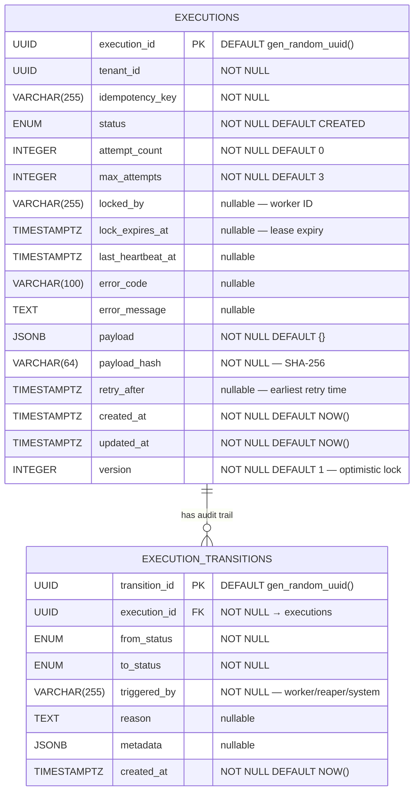
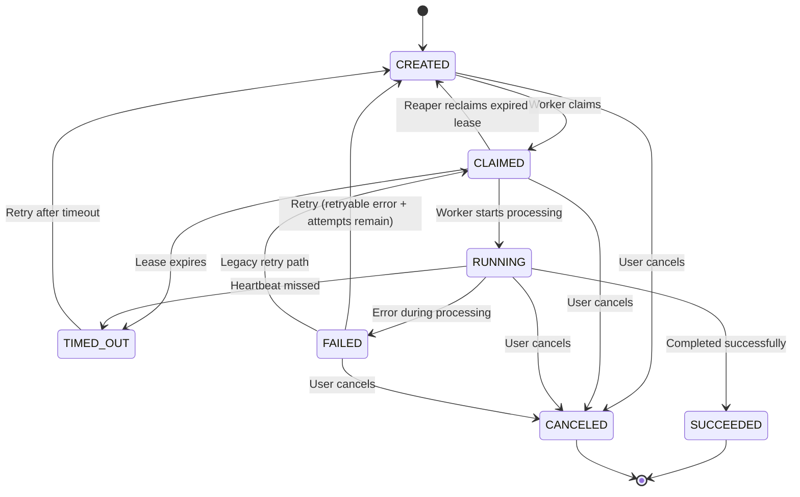

# Entity Relationship Diagram

## Executions Table

### Constraints

| Name | Type | Definition |
|------|------|------------|
| `execution_id` | PRIMARY KEY | Auto-generated UUID |
| `uq_tenant_idempotency` | UNIQUE | `(tenant_id, idempotency_key)` |
| `chk_attempt_count` | CHECK | `attempt_count >= 0` |
| `chk_max_attempts` | CHECK | `max_attempts > 0` |
| `chk_version` | CHECK | `version > 0` |

### Indexes

| Name | Columns | Condition | Purpose |
|------|---------|-----------|---------|
| `idx_executions_claimable` | `(tenant_id, status, lock_expires_at)` | `WHERE status IN ('CREATED','FAILED')` | Worker claim queries |
| `idx_executions_expired_leases` | `(lock_expires_at)` | `WHERE locked_by IS NOT NULL` | Dead worker lease reaper |
| `idx_executions_tenant_status` | `(tenant_id, status, created_at DESC)` | — | API list/filter queries |
| `idx_transitions_execution` | `(execution_id, created_at)` | — | Audit trail lookups |

### Trigger

`trg_executions_updated_at` — auto-updates `updated_at` column on every row modification.

---

## Execution Status State Machine

### Terminal States
- **SUCCEEDED** — execution completed successfully
- **CANCELED** — execution canceled by user

### Non-Terminal Failure States
- **FAILED** — can be retried (→ CREATED) if error is retryable and attempts remain
- **TIMED_OUT** — can be retried (→ CREATED) via reaper recovery
